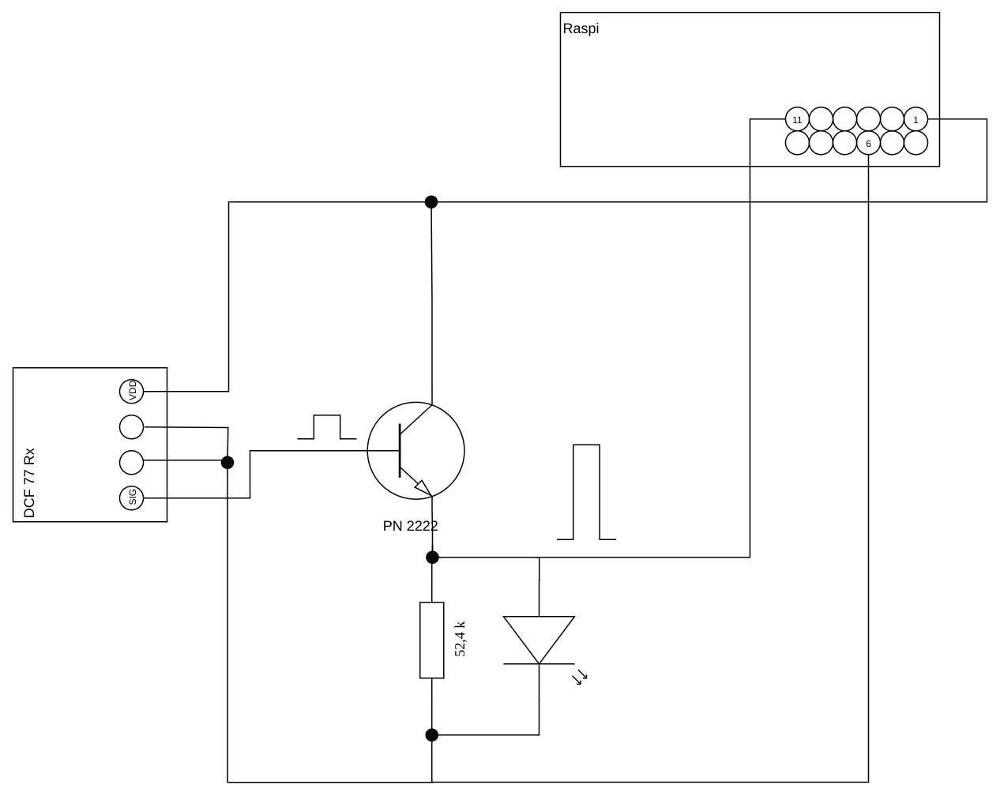

# DCF77-receiver

Simple C Application that reads the current time from the DCF77 signal from Frankfurt Germany.

## Dependencies
wiringPi library ;-)

## Hardware
Look for "DCF77 modul" or "DCF77 receiver" on your favourite search engine. When connecting it to the raspberry pi, don't fortget proper pull-up/ pull-down resistors.

## Links
[DCF77 spec](https://www.ptb.de/cms/ptb/fachabteilungen/abt4/fb-44/ag-442/verbreitung-der-gesetzlichen-zeit/dcf77/zeitcode.html)  
[decoding](http://www.stefan-buchgeher.info/elektronik/dcf2/dcf.html)
