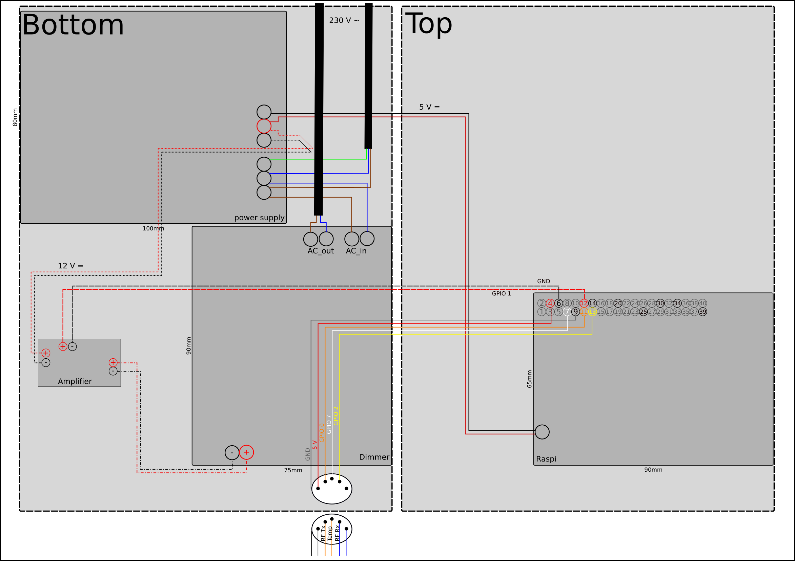

# terrarium-light-control

In order to control the light in our terrarium, i came up with this solution:
- use sunwait library to calculate the sunrise/ sunset times every day
- drive a linear voltage amplifier to control a 12 V dimmer for a couple of 240 V lamps
- when dimming the light, don't increase voltage linearly but exponentially to imitate natural sunrise
- measure temperature and humity in the terrarium using a DHT11 sensor

## applications
- PWM: test applications for the exponentially increasing output voltage
- terrarium: main app to start the light in the terrarium
- CalSunDay: helping app which modifies the sunrise/ sunset times for more convenience

## Dependencies
wiringPi library ;-)

## Hardware
- **power supply**: Meanwell RD-35A 35W
- **dimmer**: Velleman K8064
- **amplifier**: self-made based on low pass filter and LM324

## Links
[Raspi_howToPwm](https://forums.raspberrypi.com/viewtopic.php?f=37&t=124130)  
[PWM_lowpass](https://www.mikrocontroller.net/articles/Pulsweitenmodulation#DA-Wandlung_mit_PWM)  
[PWM_frequency1](https://raspberrypi.stackexchange.com/questions/4906/control-hardware-pwm-frequency)  
[PWM_frequency2](https://raspberrypi.stackexchange.com/questions/53854/driving-pwm-output-frequency)  
